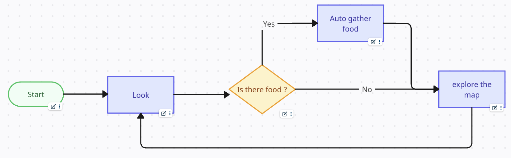
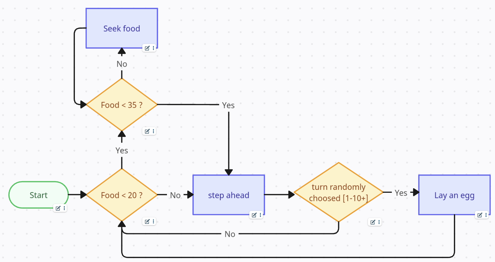

# List of available Artificial intelligences / Algorithms

---

## Survivor

### Objective

The objective of the Survivor AI is to... Survive... by exploring and collecting
every food they find.

### Type

This AI is an algorithm

### Rules

First look around, if there is food, auto gather this food.
Then explore the map and start again.

---

### Objective

This algorithm focus and surviving and laying eggs around the map.

### Type

This AI is an algorithm

### Rules

Check if its food is low. If it is under 20, seek food till 35 and then step ahead
and randomly lays an egg. And restart.

---